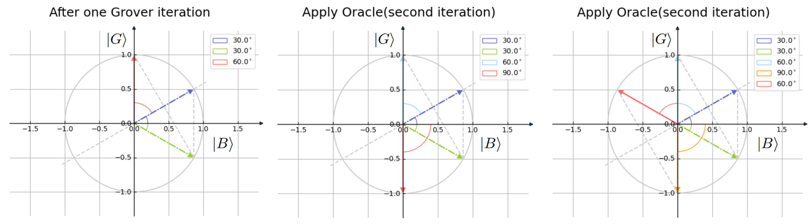
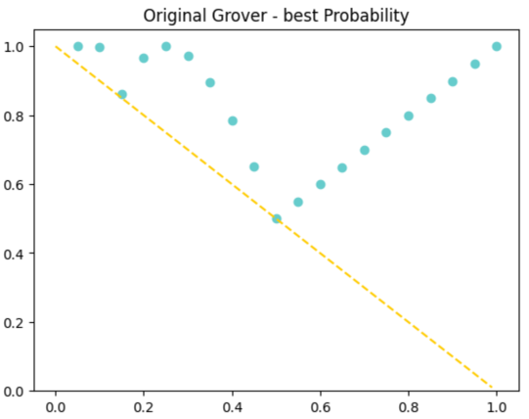
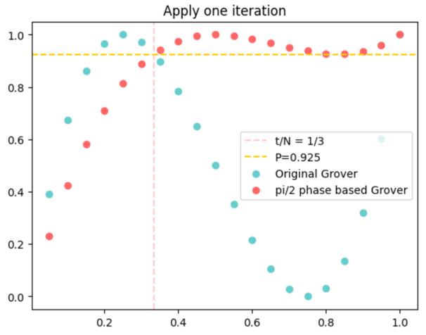
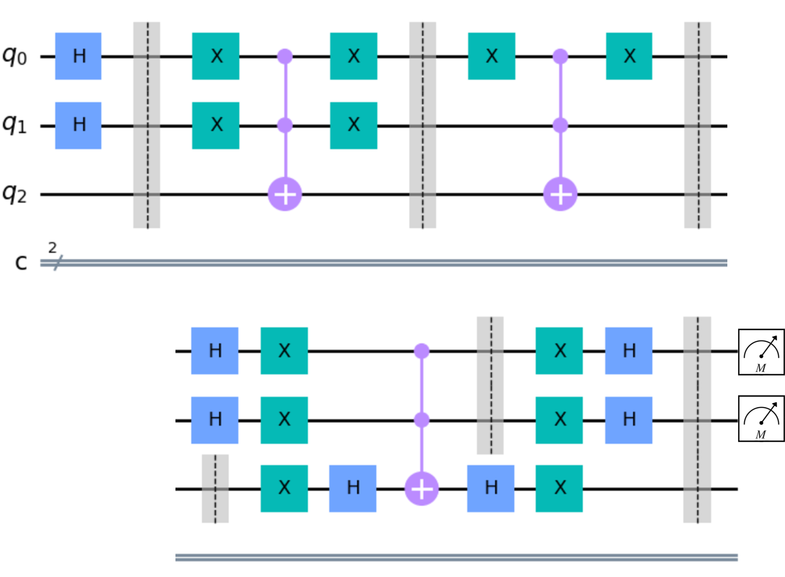

# Grover Algorithm

Grover Algorithm implemented using Qiskit.

detail can be seen in grover.pptx.

## Index

+ Grover 算法简介
  1. grover algorithm - find 3.ipynb
  2. grover algorithm - find 6.ipynb
  3. Amplitude amplification
+ Grover 算法的几何视角解释
  4. geometrical interpretation
+ Grover 查询次数与成功率
+ Grover 算法改进
+ Grover 算法的几种应用

完整算法代码：grover_algorithm.ipynb

## Some Slides:

+ angle representation to show Grover operation:

+ best probability when apply Grover algorithm:

+ success rate when apply one iteration:

+ quantum circuit implementing Grover:

