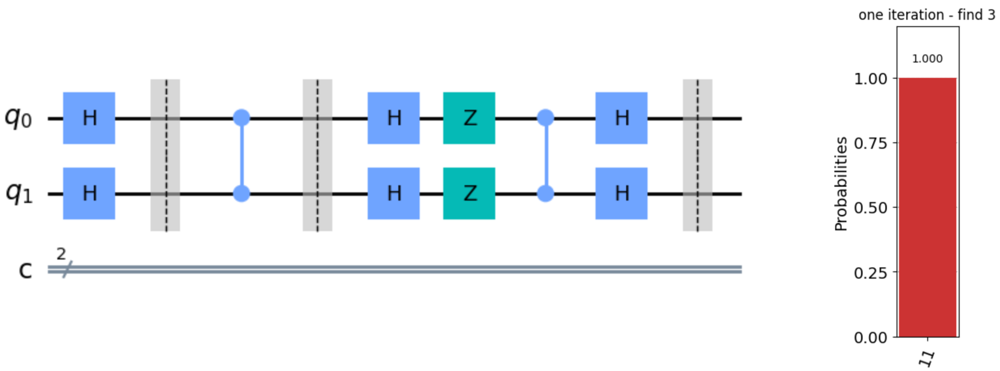
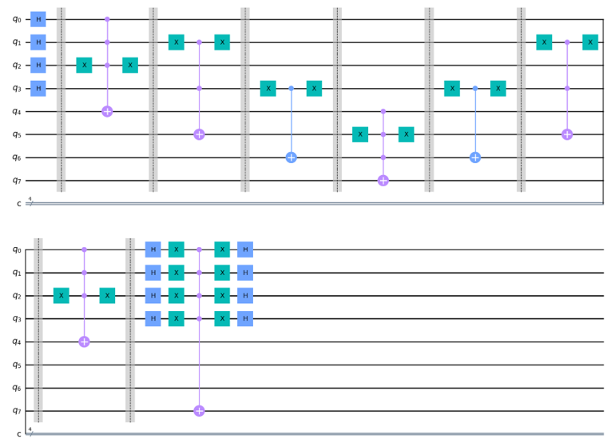

# Grover Algorithm

Grover Algorithm implemented using Qiskit.

detail can be seen in grover.pptx.

## Index

+ Grover 算法简介
  
  1. grover algorithm - find 3.ipynb
  2. grover algorithm - find 6.ipynb
  3. Amplitude amplification
+ Grover 算法的几何视角解释
  
  4. geometrical interpretation
  5. Worst Case when t/N = 1/2
+ Grover 查询次数与成功率
  
  6. different phase rotation Grover
  7. tight bound on iteration times when unknown t N
+ Grover 算法改进
  
  8. youne algorithm
+ Grover 算法的几种应用
  
  9. SAT

## Some Slides:

+ simple example about find 3 (see `1. grover algorithm - find 3.ipynb`):

+ geometrical interpretation to show Grover operation (see `4. geometrical interpretation`):

+ best probability when apply Grover algorithm (see `6. different phase rotation Grover`):

+ success rate when apply one iteration (see `6. different phase rotation Grover`):

+ quantum circuit implementing Grover (use partial diffuser operator, see `8. youne algorithm`):

+ Grover application for SAT (see `9. SAT`):

